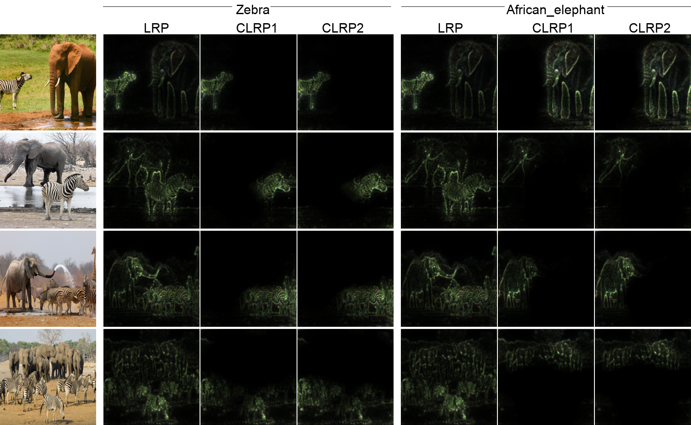

# Contrastive_LRP

## This is a pytorch implemention of the following work Contrastive layerwise relevance propagation (CLRP):
Requirements: numpy==1.14.2; python==3.6.4; pytorch==1.1.0;

The code creates CLRP saliency maps to explain individual classification on VGG16 model.
```
python CLRP/run.py
```
The results are visualized as follows:



If this repo is helpful for you, please cite our work.
```
@inproceedings{gu2018understanding,
  title={Understanding individual decisions of cnns via contrastive backpropagation},
  author={Gu, Jindong and Yang, Yinchong and Tresp, Volker},
  booktitle={Asian Conference on Computer Vision},
  pages={119--134},
  year={2018},
  organization={Springer}
}
```
